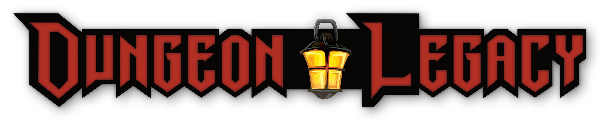

# Dungeon Lagacy

>The Dungeon Legacy RPG is currently in development. You can follow this project through the *[Changelog](docs/changelog.md)* file.

Dungeon Legacy is a fantasy tabletop roleplaying game built upon the framework of many modern OSR-styled roleplaying games.

The official [Dungeon Legacy](https://oldmanumby.github.io/DungeonLegacy/) site is built with a custom template using [Material for MkDocs](https://squidfunk.github.io/mkdocs-material/getting-started/), a powerful [Markdown](https://www.markdownguide.org) documentation framework on top of [MkDocs](https://www.mkdocs.org), a static site generator for project documentation, and hosted through GitHub Pages.